# Snow Kitchen - System Flowcharts & Diagrams

This document contains visual representations of all major processes in the Snow Kitchen Equipment Maintenance Management System.

---

## Table of Contents

1. [System Overview](#1-system-overview)
2. [User Roles](#2-user-roles)
3. [AMC Notification Flow](#3-amc-notification-flow)
4. [Chatbot Inquiry Flow](#4-chatbot-inquiry-flow)
5. [Service Request Lifecycle](#5-service-request-lifecycle)
6. [Technician Assignment Flow](#6-technician-assignment-flow)
7. [Client Journey Maps](#7-client-journey-maps)
8. [Admin Dashboard Flow](#8-admin-dashboard-flow)

---

## 1. System Overview

### How the System Works

```mermaid
flowchart TB
    subgraph Clients["👥 CLIENTS"]
        C1["AMC Clients"]
        C2["On-Call Clients"]
    end

    subgraph Channels["📱 COMMUNICATION"]
        CH1["WhatsApp"]
        CH2["Viber"]
        CH3["Telegram"]
    end

    subgraph System["💻 SNOW KITCHEN SYSTEM"]
        NS["Notification<br/>System"]
    end

    subgraph App["📱 MAIN APPLICATION"]
        CP["Client<br/>Portal"]
        SR["Service<br/>Requests"]
        TM["Technician<br/>Management"]
        AD["Admin<br/>Dashboard"]
    end

    subgraph Team["👷 SNOW KITCHEN TEAM"]
        Admin["Admin"]
        Ops["Operations<br/>Manager"]
        Tech["Technicians"]
    end

    C1 -->|Scheduled Services| NS
    C2 --> Channels
    Channels --> App
    NS --> App
    
    CP --> SR
    SR --> TM
    TM --> Tech
    AD --> Admin
    AD --> Ops
```

### System Components Diagram

```mermaid
flowchart TB
    subgraph Clients["👥 CLIENTS"]
        AMC["Annual Contract<br/>Clients"]
        OC["On-Call<br/>Clients"]
    end

    subgraph Channels["📱 COMMUNICATION CHANNELS"]
        WA["WhatsApp"]
        VB["Viber"]
        TG["Telegram"]
    end

    subgraph System["💻 SNOW KITCHEN APP"]
        CB["Chatbot"]
        SR["Service Requests"]
        NS["Notification<br/>System"]
        TM["Technician<br/>Management"]
        AD["Admin<br/>Dashboard"]
    end

    subgraph Team["👷 SNOW KITCHEN TEAM"]
        Admin["Admin"]
        Ops["Operations<br/>Manager"]
        Tech["Technicians"]
    end

    AMC --> NS
    OC --> Channels
    Channels --> CB
    CB --> SR
    NS --> SR
    SR --> TM
    TM --> Tech
    AD --> Admin
    AD --> Ops
```

---

## 2. User Roles

### Who Does What?


### Client Types

```mermaid
flowchart LR
    subgraph AMCClient["📋 AMC CLIENT"]
        AC1["Receive maintenance<br/>reminders"]
        AC2["Get service updates"]
        AC3["Chat with<br/>Snow Kitchen"]
        AC4["Scheduled regular<br/>visits"]
    end

    subgraph OnCallClient["📞 ON-CALL CLIENT"]
        OC1["Report issues<br/>via chat"]
        OC2["Request emergency<br/>service"]
        OC3["Get service updates"]
        OC4["Pay per service"]
    end
```

### Role Access Matrix

```mermaid
flowchart LR
    subgraph Roles["USER ROLES"]
        A["👑 Admin"]
        O["📋 Operations"]
        T["🔧 Technician"]
    end

    subgraph Access["SYSTEM ACCESS"]
        D["Dashboard"]
        AN["Analytics"]
        C["Clients"]
        J["Jobs"]
        CH["Chat"]
        S["Settings"]
    end

    A -->|Full| D
    A -->|Full| AN
    A -->|Full| C
    A -->|Full| J
    A -->|Full| CH
    A -->|Full| S

    O -->|View| D
    O -->|Limited| AN
    O -->|Manage| C
    O -->|Assign| J
    O -->|Respond| CH

    T -->|Own Only| J
```

---

## 3. AMC Notification Flow

### How Annual Maintenance Reminders Work


### AMC Notification Flow Diagram

```mermaid
flowchart TD
    Start([🗓️ System checks<br/>maintenance schedule<br/>DAILY]) --> Check{Service<br/>coming up?}
    
    Check -->|No| End1([Wait for<br/>next check])
    Check -->|Yes| Days{How many<br/>days away?}
    
    Days -->|30 days| N30["📧 Send reminder<br/>to ADMIN only"]
    Days -->|14 days| N14["📧 Send reminder<br/>to ADMIN + CLIENT"]
    Days -->|7 days| N7["📧 Send URGENT reminder<br/>to ADMIN + CLIENT"]
    Days -->|1 day| N1["📧 Send FINAL reminder<br/>to ALL PARTIES"]
    
    N30 --> Log["📝 Log notification<br/>in system"]
    N14 --> Log
    N7 --> Log
    N1 --> Log
    
    Log --> Assign{Technician<br/>assigned?}
    
    Assign -->|No| Alert["⚠️ Alert Operations<br/>to assign technician"]
    Assign -->|Yes| Confirm["✅ Confirm with<br/>technician"]
    
    Alert --> End2([Continue<br/>monitoring])
    Confirm --> End2
```

---

## 4. Chatbot Inquiry Flow

### How Chatbot Handles Client Messages

```mermaid
sequenceDiagram
    participant Client
    participant Chatbot
    participant System
    participant SnowKitchen as Snow Kitchen Team

    Client->>Chatbot: "Hi, my freezer is not working"
    Chatbot->>Client: "Hello! I'm here to help.<br/>What type of equipment?"
    Client->>Chatbot: "Freezer"
    Chatbot->>Client: "What's the problem?<br/>1) Not cooling<br/>2) Making noise<br/>3) Other"
    Client->>Chatbot: "1 - Not cooling"
    Chatbot->>Client: "Is this urgent?<br/>1) Yes, emergency<br/>2) No, can wait"
    Client->>Chatbot: "1 - Emergency"
    Chatbot->>System: Create Service Request
    System->>SnowKitchen: 🔔 NEW REQUEST!<br/>Priority: CRITICAL
    Chatbot->>Client: "Request #12345 created!<br/>Our team will contact you<br/>within 4 hours."
```

### Detailed Chatbot Flow

```mermaid
flowchart TD
    Start([📱 Client sends<br/>message]) --> Platform{Which<br/>platform?}
    
    Platform -->|WhatsApp| WA["WhatsApp API"]
    Platform -->|Viber| VB["Viber API"]
    Platform -->|Telegram| TG["Telegram API"]
    
    WA --> Bot["🤖 Chatbot<br/>receives message"]
    VB --> Bot
    TG --> Bot
    
    Bot --> Identify{Client<br/>recognized?}
    
    Identify -->|No| Register["Register new client<br/>Ask: Name, Business,<br/>Phone, Address"]
    Identify -->|Yes| Greet["Welcome back!<br/>How can I help?"]
    
    Register --> Greet
    
    Greet --> Type{What do<br/>you need?}
    
    Type -->|Report Problem| Problem["Ask about:<br/>• Equipment type<br/>• Problem description<br/>• Urgency level"]
    Type -->|Check Status| Status["Show existing<br/>request status"]
    Type -->|Schedule Service| Schedule["Show available<br/>dates"]
    Type -->|Talk to Human| Human["🔄 Transfer to<br/>Operations team"]
    
    Problem --> Create["📝 Create<br/>service request"]
    Schedule --> Create
    
    Create --> Priority{Priority<br/>level?}
    
    Priority -->|Critical| Alert1["🚨 URGENT ALERT<br/>to Snow Kitchen"]
    Priority -->|Normal| Alert2["📧 Normal notification<br/>to Snow Kitchen"]
    
    Alert1 --> Confirm["✅ Send confirmation<br/>to client with<br/>Request ID"]
    Alert2 --> Confirm
    
    Confirm --> End([Wait for<br/>next message])
    Status --> End
    Human --> End
```

---

## 5. Service Request Lifecycle

### Journey of a Service Request

```mermaid
flowchart LR
    subgraph Stage1["📝 CREATED"]
        NEW["🆕 NEW<br/>Request created<br/>from chat/AMC"]
    end

    subgraph Stage2["📋 ASSIGNED"]
        ASSIGNED["📋 ASSIGNED<br/>Technician assigned<br/>by Ops Manager"]
    end

    subgraph Stage3["🚗 IN PROGRESS"]
        ROUTE["🚗 EN ROUTE"]
        ARRIVED["📍 ARRIVED"]
        WORK["🔧 WORKING"]
    end

    subgraph Stage4["✅ COMPLETED"]
        DONE["✅ COMPLETED<br/>Job done,<br/>client notified"]
    end

    subgraph Stage5["📁 CLOSED"]
        CLOSED["📁 CLOSED<br/>Feedback collected<br/>case archived"]
    end

    NEW --> ASSIGNED --> ROUTE --> ARRIVED --> WORK --> DONE --> CLOSED
```

### Priority Response Times

```mermaid
flowchart TB
    subgraph Priority["⏱️ PRIORITY LEVELS"]
        P1["🔴 CRITICAL<br/>Must complete within 4 hours"]
        P2["🟠 HIGH<br/>Must complete within 8 hours"]
        P3["🟡 MEDIUM<br/>Must complete within 24 hours"]
        P4["🟢 LOW<br/>Must complete within 48 hours"]
    end
```

### Detailed Request Flow

```mermaid
flowchart TD
    subgraph Create["📝 REQUEST CREATION"]
        C1["From Chatbot"] --> New["NEW REQUEST"]
        C2["From AMC Schedule"] --> New
        C3["Manual Entry"] --> New
    end
    
    New --> Review["Operations reviews<br/>request details"]
    
    Review --> Valid{Valid<br/>request?}
    
    Valid -->|No| Cancel["❌ CANCELLED<br/>Notify client"]
    Valid -->|Yes| Assign["Select technician<br/>based on:<br/>• Availability<br/>• Skills<br/>• Location"]
    
    Assign --> Assigned["✅ ASSIGNED<br/>Notify technician"]
    
    Assigned --> Accept{Technician<br/>accepts?}
    
    Accept -->|No| Reassign["Assign different<br/>technician"]
    Accept -->|Yes| EnRoute["🚗 EN ROUTE<br/>Notify client"]
    
    Reassign --> Assigned
    
    EnRoute --> Arrive["📍 ARRIVED<br/>at location"]
    
    Arrive --> Work["🔧 WORK STARTED"]
    
    Work --> Parts{Parts<br/>needed?}
    
    Parts -->|Yes| Pause["⏸️ PAUSED<br/>Order parts"]
    Parts -->|No| Complete["✅ COMPLETED"]
    
    Pause --> PartsArrive["Parts arrive"]
    PartsArrive --> Work
    
    Complete --> Notify["📧 Notify client:<br/>Job completed"]
    
    Notify --> Feedback["Collect feedback"]
    
    Feedback --> Close["📁 CLOSED"]
```

---

## 6. Technician Assignment Flow

### How Jobs Get Assigned

```mermaid
flowchart TD
    Request["📋 NEW SERVICE REQUEST<br/>Equipment: Freezer"] --> Match["🔍 MATCH SPECIALIZATION"]
    
    Match --> Available["👷 AVAILABLE TECHNICIANS"]
    
    subgraph Techs["Check Availability"]
        T1["✅ Ahmed - Free<br/>Refrigeration Expert"]
        T2["❌ Omar - Busy<br/>On another job"]
        T3["✅ Khalid - Free<br/>General Technician"]
    end
    
    Available --> Techs
    
    Techs --> Select["📍 SELECT BEST FIT<br/>Ahmed assigned<br/>(Closest to location)"]
    
    Select --> Notify["📱 NOTIFICATION<br/>SENT TO AHMED"]
    
    Notify --> Done["✅ Assignment Complete"]
```

### Assignment Decision Flow

```mermaid
flowchart TD
    Start([📋 New service<br/>request]) --> Type["Identify equipment type<br/>& required skills"]
    
    Type --> Find["Find technicians with<br/>matching specialization"]
    
    Find --> Available{Any<br/>available?}
    
    Available -->|No| Wait["⏳ Add to queue<br/>Alert admin"]
    Available -->|Yes| Filter["Filter by:<br/>1. Current workload<br/>2. Location proximity<br/>3. Experience level"]
    
    Wait --> CheckAgain["Check every 30 mins"]
    CheckAgain --> Available
    
    Filter --> Select["📍 Select best<br/>matching technician"]
    
    Select --> Notify["📱 Send job details<br/>to technician"]
    
    Notify --> Response{Response<br/>within 15 min?}
    
    Response -->|No response| Next["Try next available<br/>technician"]
    Response -->|Declined| Next
    Response -->|Accepted| Confirm["✅ Confirm assignment"]
    
    Next --> Available
    
    Confirm --> Update["Update request status<br/>to ASSIGNED"]
    
    Update --> ClientNotify["📧 Notify client:<br/>Technician assigned"]
    
    ClientNotify --> End([Assignment<br/>complete])
```

---

## 7. Client Journey Maps

### AMC Client Journey

```mermaid
flowchart LR
    subgraph Step1["😊 SIGN UP"]
        S1["Sign annual<br/>contract"]
    end

    subgraph Step2["📧 REMINDERS"]
        S2["Get automatic<br/>reminders"]
    end

    subgraph Step3["🔧 SERVICE"]
        S3["Technician visits<br/>for maintenance"]
    end

    subgraph Step4["📝 REPORT"]
        S4["Receive service<br/>report & invoice"]
    end

    S1 --> S2 --> S3 --> S4
    S4 -.->|Repeat Cycle<br/>Monthly/Quarterly/Annually| S2
```

### AMC Client - Additional Options

```mermaid
flowchart TB
    AMC["📋 AMC CLIENT"] --> Regular["🔄 Regular Scheduled<br/>Maintenance"]
    AMC --> Chat["💬 Can Chat<br/>Anytime"]
    AMC --> Emergency["🚨 Can Report<br/>Emergency"]
    
    Regular --> Service["🔧 Get Service"]
    Chat --> Service
    Emergency --> Service
```

### On-Call Client Journey

```mermaid
flowchart LR
    subgraph Problem["😰 PROBLEM OCCURS"]
        P1["Equipment<br/>breaks down"]
    end
    
    subgraph Contact["📱 CONTACT"]
        C1["Open WhatsApp/<br/>Viber/Telegram"]
        C2["Chat with<br/>Snow Kitchen bot"]
    end
    
    subgraph Request["📝 REQUEST"]
        R1["Describe<br/>problem"]
        R2["Get request<br/>confirmation"]
    end
    
    subgraph Service["🔧 SERVICE"]
        S1["Technician<br/>assigned"]
        S2["Tech arrives<br/>& fixes"]
    end
    
    subgraph Done["✅ COMPLETE"]
        D1["Problem<br/>solved!"]
        D2["Pay for<br/>service"]
    end
    
    P1 --> C1 --> C2 --> R1 --> R2 --> S1 --> S2 --> D1 --> D2
```

---

## 8. Admin Dashboard Flow

### What Admin Can Do

```mermaid
flowchart TB
    subgraph Overview["📊 OVERVIEW PANEL"]
        OV1["Today's Jobs: 12"]
        OV2["Open Requests: 8"]
        OV3["Technicians: 5/7 Available"]
        OV4["Completed: 8"]
        OV5["Urgent: 2"]
    end

    subgraph Modules["🔧 DASHBOARD MODULES"]
        M1["📈 Analytics<br/>Daily/Weekly/Monthly charts<br/>Filter data"]
        M2["👥 Clients<br/>View all / Add new<br/>Edit details / View history"]
        M3["🔧 Technicians<br/>View all / Add new<br/>Assign jobs / View schedule"]
        M4["💬 Chats<br/>View all / Respond<br/>Take over / History"]
        M5["📋 Requests<br/>View all / Create new<br/>Assign / Close"]
        M6["⚙️ Settings<br/>Users / Notifications<br/>System / Reports"]
    end

    Overview --> Modules
```

### Analytics Dashboard Views

```mermaid
flowchart TD
    subgraph Dashboard["📊 ADMIN DASHBOARD"]
        Main["Main View"]
    end
    
    Main --> Daily["📅 DAILY VIEW"]
    Main --> Weekly["📆 WEEKLY VIEW"]
    Main --> Monthly["🗓️ MONTHLY VIEW"]
    Main --> Custom["🔍 CUSTOM FILTER"]
    
    Daily --> D1["• Jobs completed today<br/>• New requests<br/>• Active chats<br/>• Technician status"]
    
    Weekly --> W1["• Trend comparison<br/>• Busy days<br/>• Performance metrics"]
    
    Monthly --> M1["• Total services<br/>• Client acquisition<br/>• Revenue summary<br/>• Equipment patterns"]
    
    Custom --> Filters["FILTER BY:"]
    
    Filters --> F1["Date Range"]
    Filters --> F2["Client Type"]
    Filters --> F3["Equipment"]
    Filters --> F4["Technician"]
    Filters --> F5["Priority"]
    Filters --> F6["Status"]
    Filters --> F7["Location"]
```

### Report Generation Flow

```mermaid
flowchart LR
    subgraph Step1["1️⃣ SELECT REPORT TYPE"]
        R1["Service Summary"]
        R2["Client Report"]
        R3["Technician Performance"]
    end

    subgraph Step2["2️⃣ APPLY FILTERS"]
        F1["☑️ Date Range"]
        F2["☑️ Client"]
        F3["☑️ Type"]
        F4["☑️ Status"]
        F5["☑️ Technician"]
        F6["☑️ Area"]
    end

    subgraph Step3["3️⃣ GENERATE & EXPORT"]
        E1["Preview Report"]
        E2["Export as PDF"]
        E3["Export as Excel"]
        E4["Send via Email"]
    end

    Step1 --> Step2 --> Step3
```

---

## 9. Overall System Flow Diagram

### Complete System Interaction

```mermaid
flowchart TB
    subgraph Clients["👥 CLIENTS"]
        AMC["AMC Client<br/>(Annual Contract)"]
        OC["On-Call Client<br/>(No Contract)"]
    end
    
    subgraph Messaging["📱 MESSAGING PLATFORMS"]
        WA["WhatsApp"]
        VB["Viber"]  
        TG["Telegram"]
    end
    
    subgraph Bot["🤖 CHATBOT LAYER"]
        CB["Unified Chatbot<br/>• Greeting<br/>• Collect info<br/>• Create request<br/>• Handoff to human"]
    end
    
    subgraph Core["💻 CORE SYSTEM"]
        SR["Service Requests<br/>Database"]
        NS["Notification<br/>Service"]
        TM["Technician<br/>Management"]
        CM["Client<br/>Management"]
    end
    
    subgraph Admin["🖥️ ADMIN PORTAL"]
        DASH["Dashboard"]
        ANAL["Analytics"]
        MGMT["Management"]
    end
    
    subgraph Team["👷 FIELD TEAM"]
        TECH["Technicians"]
    end
    
    %% Client flows
    AMC -->|"Scheduled Service"| NS
    AMC --> WA
    OC --> WA
    OC --> VB
    OC --> TG
    
    %% Messaging to Bot
    WA --> CB
    VB --> CB
    TG --> CB
    
    %% Bot to System
    CB -->|"Create Request"| SR
    CB -->|"Notify Team"| NS
    
    %% Core System connections
    NS --> SR
    SR --> TM
    CM --> SR
    
    %% Admin connections
    SR --> DASH
    TM --> DASH
    CM --> DASH
    DASH --> ANAL
    DASH --> MGMT
    
    %% Technician flow
    TM -->|"Assign Job"| TECH
    TECH -->|"Update Status"| SR
    
    %% Feedback loop
    TECH -->|"Job Complete"| NS
    NS -->|"Notify Client"| Messaging
```

---

## 10. Quick Reference - Status Flow

### Service Request Statuses

```mermaid
stateDiagram-v2
    [*] --> NEW: Request Created
    NEW --> ASSIGNED: Technician Selected
    NEW --> CANCELLED: Invalid Request
    
    ASSIGNED --> CANCELLED: Client Cancels
    ASSIGNED --> EN_ROUTE: Tech Accepts
    
    EN_ROUTE --> ARRIVED: Tech at Location
    
    ARRIVED --> WORK_IN_PROGRESS: Work Begins
    
    WORK_IN_PROGRESS --> PAUSED: Parts Needed
    WORK_IN_PROGRESS --> COMPLETED: Job Done
    
    PAUSED --> WORK_IN_PROGRESS: Parts Arrive
    
    COMPLETED --> CLOSED: Feedback Collected
    
    CLOSED --> [*]
    CANCELLED --> [*]
```

### Status Quick Reference

```mermaid
flowchart LR
    NEW["🆕 NEW"] --> ASSIGNED["📋 ASSIGNED"] --> ENROUTE["🚗 EN ROUTE"] --> ARRIVED["📍 ARRIVED"]
    ARRIVED --> WORK["🔧 WORK IN<br/>PROGRESS"]
    WORK --> COMPLETED["✅ COMPLETED"] --> CLOSED["📁 CLOSED"]
    WORK -.-> PAUSED["⏸️ PAUSED"]
    PAUSED -.-> WORK
    NEW -.-> CANCELLED["❌ CANCELLED"]
    ASSIGNED -.-> CANCELLED
```

---

## Legend

```mermaid
flowchart LR
    subgraph Symbols["SYMBOL LEGEND"]
        S1["📱 Mobile/App"]
        S2["🤖 Chatbot/Automated"]
        S3["👥 Clients"]
        S4["👷 Technicians"]
        S5["👤 Admin/User"]
        S6["📧 Notification/Email"]
        S7["🔧 Service/Repair"]
        S8["📊 Analytics"]
        S9["✅ Completed/Success"]
        S10["❌ Cancelled/Failed"]
        S11["⏳ Waiting"]
        S12["🚨 Urgent/Alert"]
    end
```

---

*Document End*
