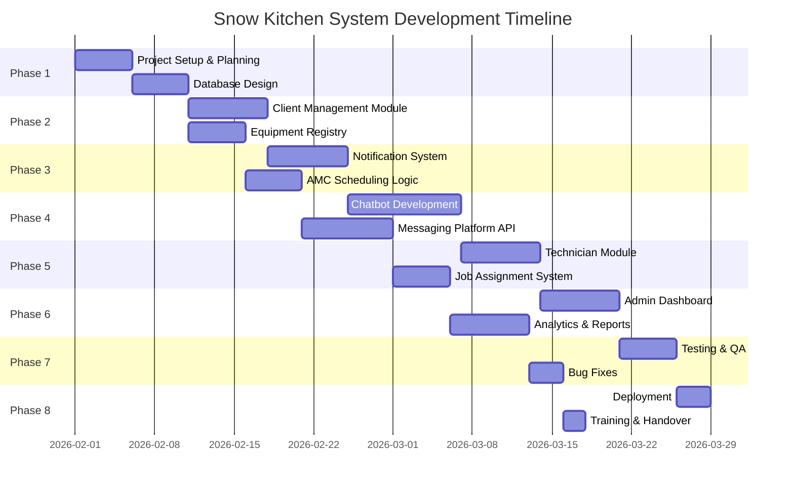

# Zkript - Project Proposal

## Snow Kitchen Equipment Maintenance Management System

---

**Prepared For:** Snow Kitchen Equipment Maintenance  
**Location:** Abu Dhabi, UAE  
**Date:** January 29, 2026  
**Prepared By:** [Zkript Solutions OPC](https://www.zkript.dev)  
**Version:** 1.0

---

## Table of Contents

1. [Executive Summary](#1-executive-summary)
2. [Project Overview](#2-project-overview)
   - [2.1 Objectives](#21-objectives)
   - [2.2 Key Deliverables](#22-key-deliverables)
3. [Project Timeline](#3-project-timeline)
   - [Detailed Timeline Breakdown](#detailed-timeline-breakdown)
   - [Milestones](#milestones)
4. [Project Cost](#4-project-cost)
   - [Cost Breakdown](#cost-breakdown)
   - [Optional Monthly Retainer](#optional-monthly-retainer-after-warranty)
   - [Payment Terms](#payment-terms)
5. [What's Included](#5-whats-included)
   - [5.1 Software Features](#51-software-features)
   - [5.2 Technical Deliverables](#52-technical-deliverables)
   - [5.3 Support & Warranty](#53-support--warranty-included)
   - [5.4 Monthly Retainer (Optional)](#54-monthly-retainer-optional)
6. [What's NOT Included (Future Phases)](#6-whats-not-included-future-phases)
7. [Terms & Conditions](#7-terms--conditions)
   - [7.1 Client Responsibilities](#71-client-responsibilities)
   - [7.2 Change Requests](#72-change-requests)
   - [7.3 Intellectual Property](#73-intellectual-property)
   - [7.4 Confidentiality](#74-confidentiality)
8. [Why Choose Us](#8-why-choose-us)
9. [Next Steps](#9-next-steps)
10. [Acceptance](#10-acceptance)
    - [Client](#client)
    - [Developer](#developer)
- [Contact Information](#contact-information)
- [Appendix: Related Documents](#appendix-related-documents)

---

## 1. Executive Summary

We are pleased to submit this proposal for the development of a comprehensive **Maintenance Management System** for Snow Kitchen Equipment Maintenance. This solution will streamline your operations by automating service scheduling, enabling multi-channel customer communication, and providing real-time analytics for data-driven decision making.

> **📄 Related Documents:**
> - [Business Requirements Document (BRD)](./business-requirements.md) - Detailed functional and non-functional requirements
> - [System Flowcharts & Diagrams](./flowcharts.md) - Visual process flows and system architecture

---

## 2. Project Overview

### 2.1 Objectives

| Objective | Description |
|-----------|-------------|
| Automate AMC Scheduling | Automatic notifications for upcoming annual maintenance services |
| Centralize Communications | Chatbot integration via **one platform** (WhatsApp, Viber, OR Telegram - client's choice) |
| Streamline Operations | Efficient technician assignment and job tracking |
| Enable Data Analytics | Comprehensive dashboard with charts, reports, and filtering |

### 2.2 Key Deliverables

1. **Client Management Module** - AMC and On-Call client registration with equipment registry
2. **Notification System** - Automated reminders at 30, 14, 7, and 1 day before service
3. **Chatbot Integration** - One messaging platform (WhatsApp, Viber, OR Telegram)
4. **Technician Management** - Assignment, scheduling, and status tracking
5. **Admin Dashboard** - Analytics, reports, and system management
6. **User Management** - Role-based access control (Admin, Operations, Technician)

> 📋 *For detailed requirements of each module, see the [Business Requirements Document](./business-requirements.md#5-functional-requirements)*

---

## 3. Project Timeline

### Total Duration: 8 Weeks (2 Months)

### Detailed Timeline Breakdown

| Phase | Description | Duration | Dates |
|-------|-------------|----------|-------|
| **Phase 1** | Project Setup & Planning | Week 1 | Feb 1-7, 2026 |
| | - Requirements finalization | | |
| | - Database architecture design | | |
| | - Development environment setup | | |
| **Phase 2** | Core Modules Development | Week 2-3 | Feb 8-21, 2026 |
| | - Client management module | | |
| | - Equipment registry | | |
| | - Service request system | | |
| **Phase 3** | Notification & Scheduling | Week 3-4 | Feb 15-28, 2026 |
| | - Automated notification system | | |
| | - AMC scheduling logic | | |
| | - Email/SMS integration | | |
| **Phase 4** | Chatbot Integration | Week 4-5 | Feb 22 - Mar 7, 2026 |
| | - Chatbot conversation flows | | |
| | - Selected platform API integration | | |
| | - (WhatsApp OR Viber OR Telegram) | | |
| **Phase 5** | Technician & Assignment | Week 5-6 | Mar 1-14, 2026 |
| | - Technician management | | |
| | - Job assignment system | | |
| | - Status tracking | | |
| **Phase 6** | Admin Dashboard | Week 6-7 | Mar 8-21, 2026 |
| | - Dashboard development | | |
| | - Analytics & charts | | |
| | - Report generation | | |
| **Phase 7** | Testing & QA | Week 7-8 | Mar 15-25, 2026 |
| | - System integration testing | | |
| | - User acceptance testing | | |
| | - Bug fixes & optimization | | |
| **Phase 8** | Deployment & Handover | Week 8 | Mar 26-31, 2026 |
| | - Production deployment | | |
| | - User training | | |
| | - Documentation handover | | |

### Milestones

| Milestone | Target Date | Deliverable |
|-----------|-------------|-------------|
| M1 | Feb 7, 2026 | Project kickoff complete, database design approved |
| M2 | Feb 21, 2026 | Core modules functional (Client, Equipment, Requests) |
| M3 | Mar 7, 2026 | Chatbot integration complete |
| M4 | Mar 14, 2026 | Technician module & assignment system ready |
| M5 | Mar 21, 2026 | Admin dashboard & analytics complete |
| M6 | Mar 31, 2026 | **Final delivery & go-live** |

---

## 4. Project Cost

### Total Investment: ₱150,000.00

### Cost Breakdown

| Item | Description | Cost (PHP) |
|------|-------------|------------|
| **Development** | | |
| Backend Development | API, Database, Business Logic | ₱45,000.00 |
| Frontend Development | Admin Dashboard, UI/UX | ₱35,000.00 |
| Chatbot Integration | One platform (WhatsApp OR Viber OR Telegram) | ₱25,000.00 |
| **Infrastructure** | | |
| Cloud Setup | Server configuration, SSL, Domain | ₱10,000.00 |
| Third-party Services | SMS Gateway, Email Service | ₱5,000.00 |
| **Quality Assurance** | | |
| Testing & QA | Integration, UAT, Bug fixes | ₱15,000.00 |
| **Project Management** | | |
| PM & Documentation | Planning, Coordination, Docs | ₱10,000.00 |
| **Training & Support** | | |
| User Training | On-site/Remote training sessions | ₱5,000.00 |
| | | |
| **TOTAL** | | **₱150,000.00** |

### Optional Monthly Retainer (After Warranty)

| Item | Cost (PHP) |
|------|------------|
| Monthly Retainer Fee | ₱25,000.00 / month |

> *The retainer is optional and begins after the 1-month warranty period. See [Section 5.4](#54-monthly-retainer-optional) for details.*

### Payment Terms

| Milestone | Percentage | Amount (PHP) | Due Date |
|-----------|------------|--------------|----------|
| Project Kickoff | 30% | ₱45,000.00 | Upon contract signing |
| Mid-Project Review | 40% | ₱60,000.00 | After Phase 4 (Mar 7, 2026) |
| Final Delivery | 30% | ₱45,000.00 | Upon go-live (Mar 31, 2026) |
| **TOTAL** | **100%** | **₱150,000.00** | |

---

## 5. What's Included

### 5.1 Software Features

| Module | Features | Details |
|--------|----------|---------|
| **Client Management** | AMC & On-Call client registration, Equipment registry, Service history | [View Requirements](./business-requirements.md#51-client-management-module) |
| **Notification System** | Automated reminders (30/14/7/1 days), Multi-channel notifications | [View Flow](./flowcharts.md#3-amc-notification-flow) |
| **Chatbot** | One platform integration (WhatsApp/Viber/Telegram), Inquiry handling, Human handoff | [View Flow](./flowcharts.md#4-chatbot-inquiry-flow) |
| **Technician Management** | Profiles, Specializations, Availability tracking | [View Requirements](./business-requirements.md#55-technician-management-module) |
| **Job Assignment** | Smart assignment, Priority handling, Status updates | [View Flow](./flowcharts.md#6-technician-assignment-flow) |
| **Admin Dashboard** | Real-time metrics, Analytics charts, Custom filtering | [View Flow](./flowcharts.md#8-admin-dashboard-flow) |
| **Reports** | Daily/Weekly/Monthly reports, PDF & Excel export | [View Requirements](./business-requirements.md#fr-564-report-generation) |
| **User Management** | Role-based access (Admin, Operations, Technician) | [View Requirements](./business-requirements.md#57-user-management-module) |

> 📊 *For visual process flows, see the [System Flowcharts & Diagrams](./flowcharts.md)*

### 5.2 Technical Deliverables

- Fully functional web application
- Responsive design (Desktop, Tablet, Mobile)
- Secure user authentication
- Database with backup system
- API documentation
- User manual & training materials

### 5.3 Support & Warranty (Included)

| Item | Duration |
|------|----------|
| Bug fixes & patches | 1 month after go-live |
| Technical support (email) | 1 month after go-live |
| System updates | As needed during warranty |

### 5.4 Monthly Retainer (Optional)

After the 1-month warranty period, an **optional monthly retainer** is available for ongoing support and maintenance.

#### Retainer Fee: ₱25,000.00 / month

| Service | Description |
|---------|-------------|
| **Priority Support** | Response within 24 hours for issues and inquiries |
| **Bug Fixes** | Resolution of any system bugs or errors |
| **Minor Enhancements** | Small feature tweaks and improvements (up to 8 hours/month) |
| **System Monitoring** | Regular health checks and performance monitoring |
| **Security Updates** | Security patches and vulnerability fixes |
| **Database Maintenance** | Backup verification and optimization |
| **Platform Updates** | Messaging API updates and compatibility fixes |

#### Retainer Terms

| Term | Details |
|------|---------|
| Billing Cycle | Monthly, due on the 1st of each month |
| Minimum Commitment | None (cancel anytime with 30-day notice) |
| Unused Hours | Do not roll over to next month |
| Additional Work | Beyond 8 hours billed at ₱500/hour |
| Start Date | After 1-month warranty period ends |

> **Note:** This retainer is **optional**. Without a retainer, support will be billed on a per-incident basis at standard rates.

---

## 6. What's NOT Included (Future Phases)

The following features can be developed in future phases:

| Feature | Estimated Cost |
|---------|----------------|
| Additional Messaging Platform Integration | ₱15,000 - ₱25,000 per platform |
| Mobile App for Technicians | ₱50,000 - ₱80,000 |
| Inventory/Spare Parts Management | ₱30,000 - ₱50,000 |
| Financial/Invoicing Module | ₱40,000 - ₱60,000 |
| GPS Tracking for Technicians | ₱25,000 - ₱40,000 |
| Integration with Accounting Software | ₱20,000 - ₱35,000 |

> **Note:** MVP includes ONE messaging platform. Additional platforms (WhatsApp, Viber, or Telegram) can be added in future phases.

> 📋 *For complete scope details, see [BRD - Scope Section](./business-requirements.md#4-scope)*

---

## 7. Terms & Conditions

### 7.1 Client Responsibilities

- Provide timely feedback and approvals
- Supply necessary business information and assets
- Ensure availability for testing and training sessions
- **Select preferred messaging platform** (WhatsApp, Viber, OR Telegram)
- Provide access to required third-party accounts for selected platform

### 7.2 Change Requests

- Changes to scope after approval will be assessed separately
- Additional features beyond the agreed scope will be quoted individually
- Change requests may affect timeline and cost

### 7.3 Intellectual Property

- Upon full payment, client owns the developed system
- Developer retains rights to reusable components and frameworks
- Third-party libraries remain under their respective licenses

### 7.4 Confidentiality

- All business information shared will be kept confidential
- Data security best practices will be implemented
- No client data will be shared with third parties

---

## 8. Why Choose Us

| Benefit | Description |
|---------|-------------|
| **Industry Experience** | Understanding of maintenance management workflows |
| **Modern Technology** | Latest frameworks and best practices |
| **Scalable Solution** | Built to grow with your business |
| **Dedicated Support** | Responsive communication throughout the project |
| **Quality Assurance** | Thorough testing before delivery |

---

## 9. Next Steps

1. **Review** this proposal and provide feedback
2. **Select** preferred messaging platform (WhatsApp, Viber, OR Telegram)
3. **Clarify** any questions or concerns
4. **Approve** the scope, timeline, and cost
5. **Sign** the project agreement
6. **Kickoff** the project with initial payment

---

## 10. Acceptance

By signing below, both parties agree to the terms outlined in this proposal.

### Client

| | |
|---|---|
| **Company:** | Snow Kitchen Equipment Maintenance |
| **Name:** | |
| **Title:** | |
| **Preferred Messaging Platform:** | ☐ WhatsApp  ☐ Viber  ☐ Telegram |
| **Monthly Retainer (₱25,000/mo):** | ☐ Yes, I want the retainer  ☐ No, maybe later |
| **Signature:** | |
| **Date:** | |

### Developer

| | |
|---|---|
| **Company:** | |
| **Name:** | |
| **Title:** | |
| **Signature:** | |
| **Date:** | |

---

## Contact Information

For questions regarding this proposal, please contact:

| | |
|---|---|
| **Email:** | |
| **Phone:** | |
| **Address:** | |

---

## Appendix: Related Documents

| Document | Description | Link |
|----------|-------------|------|
| **Business Requirements Document (BRD)** | Complete functional and non-functional requirements, user stories, data requirements, stakeholder analysis, and system specifications | [View BRD](./business-requirements.md) |
| **System Flowcharts & Diagrams** | Visual representations of all system processes including chatbot flows, notification timelines, service request lifecycle, technician assignment, and admin dashboard | [View Flowcharts](./flowcharts.md) |

### Quick Links to Key Sections

**Business Requirements Document:**
- [Functional Requirements](./business-requirements.md#5-functional-requirements)
- [Non-Functional Requirements](./business-requirements.md#6-non-functional-requirements)
- [Integration Requirements](./business-requirements.md#7-integration-requirements)
- [User Stories](./business-requirements.md#9-user-stories)

**System Flowcharts:**
- [System Overview](./flowcharts.md#1-system-overview)
- [User Roles](./flowcharts.md#2-user-roles)
- [AMC Notification Flow](./flowcharts.md#3-amc-notification-flow)
- [Chatbot Inquiry Flow](./flowcharts.md#4-chatbot-inquiry-flow)
- [Service Request Lifecycle](./flowcharts.md#5-service-request-lifecycle)
- [Technician Assignment Flow](./flowcharts.md#6-technician-assignment-flow)
- [Client Journey Maps](./flowcharts.md#7-client-journey-maps)
- [Admin Dashboard Flow](./flowcharts.md#8-admin-dashboard-flow)

---

*Thank you for considering our proposal. We look forward to working with Snow Kitchen Equipment Maintenance.*

---

*Proposal Valid Until: February 28, 2026*
